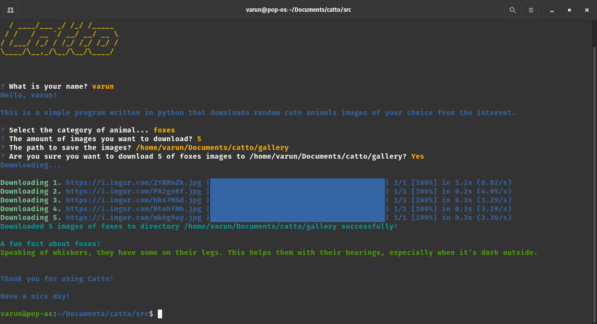

## Catto
Catto is a simple command line tool written in python that downloads random cute images of animals of your choice from the internet.
</img>

## Installation
Install the dependencies using the following command:
```
pip install -r requirements.txt
```
or if you are using poetry:
```
poetry install
```
I haven't figured how to install catto as a standalone package yet.

## Usage
Catto has two modes of usage:
```bash
catto download
```
```bash
catto interactive
```
Interactive mode is a fancy way to use catto. I can't explain it, only way to use it is to try it out.
To know more about catto run the following command:
```bash
python -m catto --help
```

## Note
The Readme.md file is not complete yet. I will add more content as I go.
