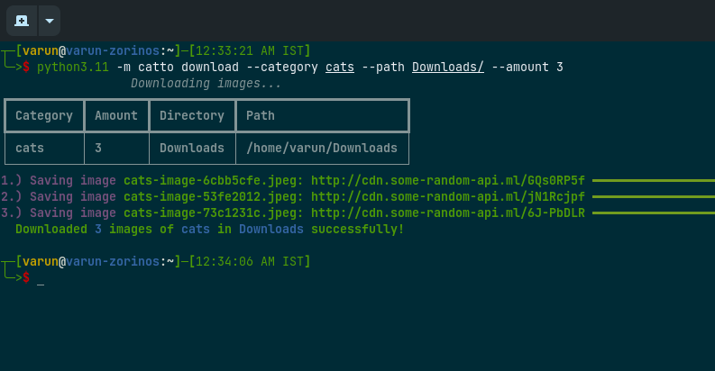

## What is Catto
Catto is a command line program that downloads random cute animal images, gifs based on your category choice.
This app is written in [Python](https://www.python.org/downloads/release/python-3110/) and uses [Typer](https://typer.tiangolo.com/) command line framework.

## Installation
Catto can be directly installed using [pip package manager](https://pip.pypa.io/en/stable/) or [Poetry package manager](https://python-poetry.org/) using git:

## Python Version Requirements
Python version: 3.10 or above is required.

<strong>Pip</strong>
```bash
pip3 install git+https://github.com/KortaPo/Catto.git
```

<strong>Poetry</strong>
```bash
poetry add git+https://github.com/KortaPo/Catto.git
```

## Catto Usage
Catto has two ways to download images:

<strong>1.) Manual</strong>
```bash
catto download --category cats --amount 3 --path ./my_directory_where_the_images_would_be_saved
```
The above command will download `3` cute and random images of `cats` ( based on your choice ) to the directory which you provided.

Let's dissect the above command a bit more:

* `--category`: This parameter takes the specific type of animal's image you wish to download.
* `--amount`: This parameter takes the amount of images of the specific animal that would be downloaded.
* `--path`: This parameter takes the path to the directory, where `catto` will download the random images.

This is the simplest and the fastest way to download your images using `catto`. 

<strong>Download Command Output</strong>
</img>

<strong>2.) Interactive</strong>
```bash
catto interactive
```
This command will start an interactive `catto` session, that will prompt you with a series of questions and choices, and based on your choices 
it will download your images. It has a fancy UI, and it is hard to explain through words, so try it yourself and see.

<strong>Interactive Command Live Output</strong>
<a href="https://asciinema.org/a/VbEQY9JRFk4TYM9jGvdEu5zl9" target="_blank"></a>

## Commands
`Catto` has the following commands:

* `catto help` - *This command shows the help menu of catto.*
* `catto download` - *Simple and a fast way to use catto to download images of your choice.*
* `catto interactive` - *Run catto in an interactive session.*
* `catto version` - *This command shows the current version of catto that is currently installed.*
* `catto status` - *This command shows all the status of all the API endpoints used by catto to search for images.*
* `catto show-all-animals` - *This command shows all the animal categories supported by catto currently.*
* `catto logo` - *This command shows the logo of catto in an animated way.

## Note
Currently, `catto` will download the images in `<selected-animal>-image-<random-hex-number>` format.

For example:
`cats-image-cdf79775`.

The reason for this feature is that they can be easily distinguished between different animal types and this allows make
sure that the images almost always have a unique random hex number.


## Credits
Well, this project is entirely free and open-source, if you want, you can certainly use it in your own projects. 

If you like this project, you can add a GitHub star to show your appreciation, and you can credit me in your project. 

Thanks :) Have a nice day!
